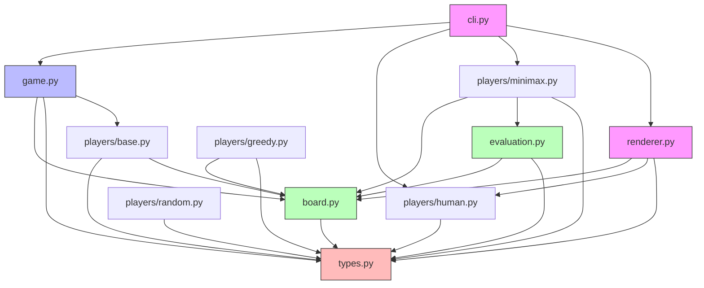
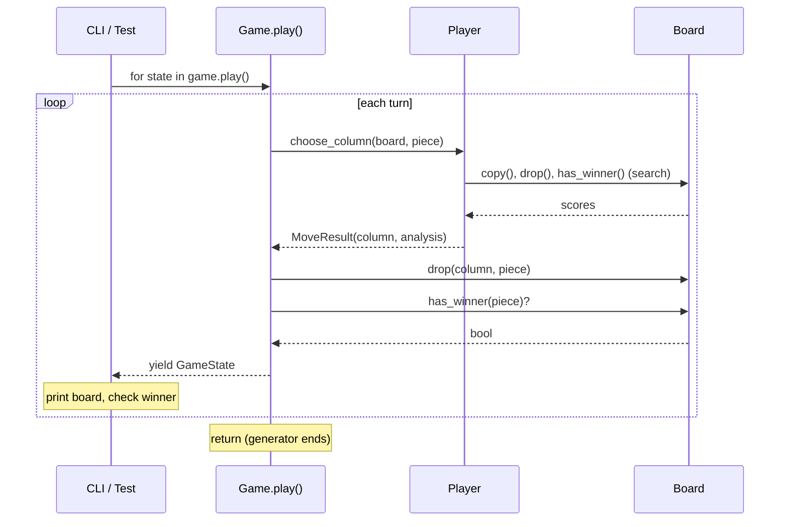

# Connect 4 — Design Spec

## Table of Contents

- [Overview](#overview)
- [Project Structure](#project-structure)
- [Design Decisions](#design-decisions)
  - [D1: Bot Algorithm — Minimax with Alpha-Beta Pruning](#d1-bot-algorithm--minimax-with-alpha-beta-pruning)
  - [D2: Player Interface — Protocol (Structural Typing)](#d2-player-interface--protocol-structural-typing)
  - [D3: Game Flow — Generator Pattern](#d3-game-flow--generator-pattern)
  - [D4: Board Representation — 2D List](#d4-board-representation--2d-list)
  - [D5: Board Constants — Class Attributes (YAGNI)](#d5-board-constants--class-attributes-yagni)
  - [D6: Naming — Player (Protocol) + Piece (Enum)](#d6-naming--player-protocol--piece-enum)
  - [D7: Evaluation Function — Pure Function, Separate File](#d7-evaluation-function--pure-function-separate-file)
  - [D8: Human Input — Dependency Injection](#d8-human-input--dependency-injection)
  - [D9: Observability — Logging + Move Analysis](#d9-observability--logging--move-analysis)
  - [D10: Move Ordering — Center-Out](#d10-move-ordering--center-out)
  - [D11: Random and Greedy Players — Separate Files](#d11-random-and-greedy-players--separate-files)
- [Core Types](#core-types)
- [Board API](#board-api)
- [Player Protocol](#player-protocol)
- [Game Orchestrator](#game-orchestrator)
- [Evaluation Function](#evaluation-function)
- [Minimax Search](#minimax-search)
- [CLI](#cli)
- [Testing Strategy](#testing-strategy)
- [Over-Engineering Traps](#over-engineering-traps)
- [Public API Surface](#public-api-surface)
- [Interview Discussion Points](#interview-discussion-points)

---

## Overview

A Python module that lets a user play Connect 4 against a bot in the terminal. The bot uses minimax with alpha-beta pruning and a heuristic evaluation function. The architecture cleanly separates game engine, player logic, and UI so that all interesting logic is importable and testable without I/O.

Target: staff+ take-home. Evaluation weights code quality, testing rigor, and system design above bot strength.

### Architecture Layers

```
┌─────────────────────────────────────────────────────┐
│                    CLI (cli.py)                      │  Outer orchestration
│              wires dependencies, runs loop           │
└──────┬───────────────────────┬────────────┬─────────┘
       │ iterates generator    │            │ delegates UI
┌──────▼───────────────────────┐   ┌────────▼─────────┐
│        Game (game.py)        │   │ TerminalRenderer │  UI Layer
│ pairs Players with Board,    │   │ (renderer.py)    │
│ yields GameStates            │   │ satisfies        │
└──────┬───────────────────────┘   │ HumanUIDelegate  │
       │ calls choose_column       └────────┬─────────┘
┌──────▼──────────┐          ┌──────────────▼─────────┐
│  Players (players/) │          │   Board (board.py)     │  Core Engine
│                     │          │                        │
│  ┌───────────────┐  │  reads   │  state, rules,         │
│  │ MinimaxPlayer ├──┼──────────▶  win/draw detection    │
│  │ RandomPlayer  │  │          │                        │
│  │ GreedyPlayer  │  │          └────────────────────────┘
│  │ HumanPlayer   │◀─┼─ inject UI
│  └───────┬───────┘  │          ┌────────────────────────┐
│          │          │          │ Evaluation             │
│          └──────────┼──────────▶ (evaluation.py)        │  Heuristics
│   (via evaluate fn) │          │ pure function          │
└─────────────────────┘          └────────────────────────┘

Shared types: Piece, GameState, MoveResult, MoveAnalysis (types.py)
```

### Module Dependency Graph



Key: nothing depends on CLI (it's the outermost layer). `types.py` and `board.py` depend on nothing outside core. Players depend on Board and Types but not on each other. Renderer is entirely decoupled from the Game.

---

## Project Structure

```
connect4/
├── __init__.py              # Public API barrel: Board, Game, Piece, Player
├── board.py                 # Board state, drop, win/draw detection
├── game.py                  # Game orchestrator (generator-based)
├── types.py                 # Piece enum, GameState, MoveAnalysis, MoveResult
├── evaluation.py            # Board evaluation heuristics (pure function)
├── players/
│   ├── __init__.py          # Exports all player implementations
│   ├── base.py              # Player protocol definition
│   ├── minimax.py           # Minimax w/ alpha-beta pruning
│   ├── random.py            # Random column selection (testing/benchmarking)
│   ├── greedy.py            # One-ply greedy (better casual-player proxy)
│   └── human.py             # Stdin-based human input
├── cli.py                   # Terminal UI entry point
└── __main__.py              # `python -m connect4` → cli.main()

tests/
├── test_board.py            # Board mechanics, win detection, edge cases
├── test_game.py             # Game flow: yields, win, draw
├── test_minimax.py          # Forced wins, forced blocks, depth behavior
├── test_evaluation.py       # Heuristic scoring correctness
└── test_bot_strength.py     # Statistical: win rates, performance budget
```

---

## Design Decisions

Each decision records what we chose, what we rejected, and why.

### D1: Bot Algorithm — Minimax with Alpha-Beta Pruning

**Chosen:** Minimax with alpha-beta pruning and a heuristic evaluation function.

**Rejected:**
- *MCTS (Monte Carlo Tree Search)* — More modern, but harder to tune and test deterministically. MCTS shines with huge branching factors (Go). Connect 4's branching factor of 7 is ideal for minimax. MCTS would signal over-investment given the "don't reinvent AlphaZero" guidance.
- *Pure rule-based / heuristic only (no search)* — Too lightweight for a staff+ submission. No tree search means the bot can't look ahead, which makes it easy to beat.
- *Reinforcement learning* — Explicitly called out as a non-requirement.

**Why:** Minimax is well-understood, deterministic, and naturally testable. The evaluation function provides interesting design decisions to discuss. Alpha-beta pruning preserves optimality (same result as full minimax, just faster). The branching factor of 7 and target depth of 6-8 make it computationally tractable.

**How minimax with alpha-beta works:**

```
                        MAX (us)
                       /    |    \
                    col 0  col 3  col 6
                    /       |       \
                 MIN      MIN      MIN (opponent)
                / | \    / | \    / | \
              ...  ... ...  ... ...  ...
                         |
                    At leaf nodes:
                    evaluate(board, piece) → score

Alpha-beta pruning: if we already found a move scoring 10,
and a branch can't possibly score higher, skip it entirely.

    MAX: best=10           ← alpha (our best guaranteed score)
         /       \
    MIN: 10    MIN: 8      ← beta (opponent's best guaranteed score)
               /  |  \        Once we see 8 < 10, prune remaining
              8  [✂]  [✂]    children — they can't change our choice.
```

**Search depth vs. performance (branching factor = 7):**

```
Depth │ Max Nodes │ With α-β Pruning │ Practical
──────┼───────────┼──────────────────┼──────────
  4   │    2,401  │       ~49        │ instant
  6   │  117,649  │      ~343        │ <0.5s
  8   │ 5.7 M    │    ~2,401        │ ~1-2s
 10   │  282 M   │   ~16,807        │ ~5-10s
 12   │ 13.8 B   │  ~117,649        │ impractical
```
*α-β best case ≈ O(b^(d/2)) vs O(b^d) without. Move ordering improves this.*

### D2: Player Interface — Protocol (Structural Typing)

**Chosen:** `typing.Protocol` — any object with a matching `choose_column` method satisfies the interface. No inheritance required.

**Rejected:**
- *ABC (Abstract Base Class)* — Requires explicit inheritance (`class Foo(Strategy)`). Fails loudly at runtime if you forget to implement a method, which is nice. But it couples every player implementation to the base class import. Less Pythonic.
- *No formal interface* — Duck typing without any type annotation. Works at runtime but gives no IDE support or type checker validation.

**Why:** Protocol is the more modern, Pythonic approach (Python 3.8+). Strategies have zero import dependency on the base module. Equivalent to TypeScript's structural interfaces, which aligns with the developer's background. Type checkers (mypy/pyright) catch mismatches at analysis time.

```
Protocol (structural — our choice):     ABC (nominal — rejected):

  players/base.py                        players/base.py
  ┌──────────────────┐                   ┌──────────────────┐
  │ Player(Protocol)  │                   │ Player(ABC)       │
  │  choose_column()  │                   │  choose_column()  │
  └──────────────────┘                   └──────────────────┘
         ▲ type-checked only                      ▲ must inherit
         │ (no import needed)                     │ (import required)
         │                                        │
  ┌──────┴───────┐                        ┌───────┴──────┐
  │MinimaxPlayer │ ← has choose_column    │MinimaxPlayer │ ← class Foo(Player)
  │              │   so it's a Player     │(Player)      │   explicit subclass
  └──────────────┘                        └──────────────┘

  Pros: zero coupling                     Pros: runtime enforcement
  Cons: errors caught late                Cons: tight coupling
```

### D3: Game Flow — Generator Pattern

**Chosen:** `Game.play()` is a generator that `yield`s `GameState` after each move. The caller drives the loop with `for state in game.play()`.

**Rejected:**
- *Callbacks/events* — `Game` accepts `on_move`, `on_win`, `on_draw` hooks. More complex: optional parameters, `if callback:` checks everywhere, Game controls the loop instead of the caller.
- *Return final result only* — `Game.play()` runs to completion, returns `GameResult`. The CLI can't display the board mid-game without I/O leaking into Game.

**Why:** Generator is simpler — Game has no knowledge of callbacks, no optional parameters. The caller decides what to do with each state. `list(game.play())` collapses the whole game for testing. Direct parallel to JavaScript `function*`/`yield`. Caller controls pacing — can add delays, prompts, or logging between moves.

**Single turn flow:**

```
┌─────────┐     ┌──────────┐     ┌──────────┐     ┌───────────┐
│  Game    │────▶│  Player  │────▶│  Board   │────▶│ Evaluation│
│          │     │          │     │  (copy)  │     │           │
│ whose    │     │ choose   │     │ try each │     │ score the │
│ turn?    │     │ column   │     │ column   │     │ position  │
└─────────┘     └──────────┘     └──────────┘     └───────────┘
     │               │                                   │
     │               │◀──────── best column ─────────────┘
     │               │
     │          MoveResult
     │          (column + analysis)
     │               │
     ▼               ▼
┌──────────────────────────┐     ┌──────────┐
│  Board.drop(col, piece)  │────▶│ Check    │
│  (mutate real board)     │     │ winner?  │
└──────────────────────────┘     │ full?    │
                                 └────┬─────┘
                                      │
                                      ▼
                                 ┌──────────┐
                                 │yield     │
                                 │GameState │──────▶ caller (CLI/test)
                                 └──────────┘
```

**Full game loop (generator perspective):**



### D4: Board Representation — 2D List

**Chosen:** `list[list[Piece | None]]` with `grid[row][col]`, row 0 = bottom.

**Rejected:**
- *Bitboard (two 64-bit integers)* — ~15x faster for win detection via bit shifts. But harder to read, debug, and modify during a live session. Overkill for depth 6-8.
- *1D flat array* — Marginally less readable. Index math (`row * COLS + col`) obscures intent.
- *NumPy array* — Adds a dependency for no meaningful benefit at this scale.

**Why:** Readability matters more than raw performance for a take-home. The 2D list is transparent — you can print it, inspect it in a debugger, reason about it instantly. Row 0 = bottom matches the physical metaphor (gravity drops pieces down). The `__str__` method reverses for display. Bitboard is a known optimization to mention in discussion.

**2D list layout (our choice):**

```
Internal grid[row][col]:          Display (__str__):

row 5: [ .  .  .  .  .  .  . ]   row 5: | .  .  .  .  .  .  . |  ← top
row 4: [ .  .  .  .  .  .  . ]   row 4: | .  .  .  .  .  .  . |
row 3: [ .  .  .  .  .  .  . ]   row 3: | .  .  .  .  .  .  . |
row 2: [ .  .  .  R  .  .  . ]   row 2: | .  .  .  R  .  .  . |
row 1: [ .  .  R  Y  .  .  . ]   row 1: | .  .  R  Y  .  .  . |
row 0: [ .  Y  R  Y  R  .  . ]   row 0: | .  Y  R  Y  R  .  . |  ← bottom
                                          0  1  2  3  4  5  6
         row 0 = bottom                     column indices
         (gravity fills upward)
```

**drop(column=2, piece=RED):** scan from row 0 upward, find first `None`, place piece there.

### D5: Board Constants — Class Attributes (YAGNI)

**Chosen:** `ROWS = 6`, `COLS = 7`, `CONNECT = 4` as class-level constants on `Board`.

**Rejected:**
- *Constructor parameters* — `Board(rows=6, cols=7, connect=4)`. Makes the board "configurable" but Connect 4 is definitionally 6x7x4. Every test would need to consider variable sizes, eval function would need generalizing, win detection gets more complex. All cost, no benefit.
- *Module-level constants* — Works but constants float free of the class they describe. `Board.ROWS` is more self-documenting than a bare `ROWS`.

**Why:** Named constants avoid magic numbers. Class attributes tie them to the class they describe. If someone asks "could this be configurable?" the answer is "yes, here's exactly where — but there's no reason to right now." This is YAGNI applied correctly.

### D6: Naming — Player (Protocol) + Piece (Enum)

**Chosen:** `Player` for the protocol (the thing that chooses moves), `Piece` for the enum (`Piece.RED`, `Piece.YELLOW`).

**Rejected:**
- *Strategy + Player* — "Strategy" implies computation, which feels wrong for `HumanPlayer`. "Player" is the natural word for both human and bot.
- *Agent + Piece* — "Agent" has AI/ML connotations that feel heavy for this context.
- *Player + Color/Side* — "Color" and "Side" work but "Piece" is more concrete — it's what's on the board.

**Why:** Reads naturally: "a Player chooses where to drop a Piece." No naming collision. `MinimaxPlayer`, `HumanPlayer`, `RandomPlayer` all make intuitive sense.

### D7: Evaluation Function — Pure Function, Separate File

**Chosen:** `evaluation.py` contains a standalone `evaluate(board, piece) -> float` function. `MinimaxPlayer` accepts an optional `evaluate` callable parameter.

**Rejected:**
- *Method on Board* — Couples scoring logic to the board data structure. Board shouldn't know about strategy.
- *Method on MinimaxPlayer* — Couples the heuristic to the search algorithm. Can't test evaluation independently.
- *Evaluator class/protocol* — Unnecessary abstraction for a stateless function. In Python, functions are first-class — a callable is already an interface.

**Why:** This is the most important architectural boundary in the project. Search and evaluation are independent concerns. You can test each in isolation: "given this board, does the evaluator return a higher score?" vs "given this evaluator, does minimax find the forced win?" The injectable parameter means you can swap heuristics without subclassing.

### D8: Human Input — Dependency Injection

**Chosen:** `HumanPlayer(input_fn=input)` — defaults to built-in `input()` but accepts any callable.

**Rejected:**
- *Mock stdin in tests* — Requires patching `sys.stdin`, which is messy and fragile.
- *Handle human input outside the Player protocol* — Would make Game aware of player types. Breaks the uniform interface.

**Why:** `HumanPlayer(input_fn=lambda _: "3")` is a one-line test setup. The Player protocol stays uniform — Game doesn't know or care whether a player is human or bot.

**Input validation:** `HumanPlayer.choose_column` handles all retry logic (non-integer input, out-of-range column, full column) inside its `while True` loop. The CLI and Game never see invalid input — it's fully contained in the player.

### D9: Observability — Logging + Move Analysis

**Chosen:** Both Python `logging` module (per-module loggers via `__name__`) and structured `MoveAnalysis` data returned alongside each move.

**Rejected:**
- *Print statements* — Not configurable, pollutes stdout, can't be filtered by module.
- *Logging only* — Logs are text. Structured analysis data is programmatically useful — tests can assert on scores, the CLI can display reasoning.
- *Analysis only* — No way to see intermediate search state without analysis at every node, which would be expensive.

**Why:** Logging shows the bot's thinking at configurable verbosity (`DEBUG` for search internals, `INFO` for chosen moves). Analysis provides structured per-column scores for the CLI and tests. Both together give full observability: debug a bot decision by turning on logging, verify correctness by inspecting analysis in tests.

### D10: Move Ordering — Center-Out

**Chosen:** Explore columns in order [3, 2, 4, 1, 5, 0, 6] (center outward) during minimax search.

**Why:** Center columns are more valuable in Connect 4 — they participate in more possible four-in-a-row lines. Exploring them first means alpha-beta pruning finds good bounds early and prunes more aggressively. This can reduce nodes explored dramatically. Trivial to implement (a constant list), significant performance gain.

```
Default order:  0  1  2  3  4  5  6   (left to right)
Our order:      3  2  4  1  5  0  6   (center outward)

Why it helps alpha-beta:
─ Center moves are usually better moves
─ Good moves explored first → tighter alpha/beta bounds early
─ Tighter bounds → more branches pruned → fewer nodes evaluated
─ Same result as left-to-right, just faster
```

### D11: Random and Greedy Players — Separate Files

**Chosen:** `RandomPlayer` (pure random) and `GreedyPlayer` (takes winning move if available, blocks if needed, otherwise random) in separate files.

**Why RandomPlayer exists:**
- Baseline opponent for bot strength tests (1000 games, assert >90% win rate)
- Development tool — quick iteration without manual play
- Performance benchmarking — zero think time opponent
- Test fixture — a real Player without building mocks
- Seeded RNG for deterministic, reproducible tests

**Why GreedyPlayer exists:**
- Better proxy for "casual player" than pure random
- Validates the bot can beat an opponent that at least takes obvious wins and blocks
- Second data point for bot strength testing

**Why separate files:** Each is independent. Easy to ignore or delete if time is tight. No coupling between them.

---

## Core Types

```python
# types.py

class Piece(enum.Enum):
    RED = "R"
    YELLOW = "Y"

    @property
    def opponent(self) -> "Piece":
        return Piece.YELLOW if self == Piece.RED else Piece.RED

@dataclasses.dataclass(frozen=True)
class GameState:
    board: "Board"
    piece: Piece              # who just moved
    column: int               # where they moved
    winner: Piece | None      # set if this move won
    is_draw: bool             # true if board full, no winner
    analysis: list["MoveAnalysis"] | None  # bot's reasoning, if available

@dataclasses.dataclass(frozen=True)
class MoveAnalysis:
    column: int
    score: float
    depth_reached: int

@dataclasses.dataclass(frozen=True)
class MoveResult:
    column: int
    analysis: list[MoveAnalysis] | None  # None for human/random
```

- `frozen=True` makes dataclasses immutable (like `Object.freeze()` in JS, `record` in Java). Prevents accidental mutation, makes them hashable.
- `Piece.opponent` property avoids scattered if/else. Properties are like JS/Java getters.

---

## Board API

```python
# board.py

class Board:
    ROWS = 6
    COLS = 7
    CONNECT = 4

    def __init__(self): ...
    def drop(self, column: int, piece: Piece) -> int:        # returns row, raises on invalid
    def is_valid_column(self, column: int) -> bool: ...
    def valid_columns(self) -> list[int]: ...
    def has_winner(self, piece: Piece) -> bool: ...
    def is_full(self) -> bool: ...
    def copy(self) -> "Board": ...
    def __str__(self) -> str: ...
```

- `has_winner(piece)` checks one piece, not both — in the game loop we only check the piece that just moved.
- `copy()` for minimax exploration. Alternative: undo/redo (faster but more error-prone). Copy is safer and performance is fine at our depth.
- `drop()` raises on invalid column — a broken player is a bug, not a game state.

**Win detection — four directions (the #1 source of bugs):**

```
Horizontal (→):       Vertical (↑):       Diagonal (↗):       Diagonal (↘):
. . . . . . .         . . . . . . .        . . . . . . .        . . . . . . .
. . . . . . .         . . . R . . .        . . . . R . .        . R . . . . .
. . . . . . .         . . . R . . .        . . . R . . .        . . R . . . .
. . . . . . .         . . . R . . .        . . R . . . .        . . . R . . .
. R R R R . .         . . . R . . .        . R . . . . .        . . . . R . .
. . . . . . .         . . . . . . .        . . . . . . .        . . . . . . .

  check (r, c+i)       check (r+i, c)      check (r+i, c+i)    check (r-i, c+i)
  for i in 0..3        for i in 0..3       for i in 0..3        for i in 0..3

Must check ALL four directions. Missing one diagonal is the classic bug.
Edge cases: wins touching the board edges (row 0, row 5, col 0, col 6).
```

---

## Player Protocol

```python
# players/base.py

class Player(Protocol):
    def choose_column(self, board: Board, piece: Piece) -> MoveResult: ...
```

Implementations: `MinimaxPlayer`, `RandomPlayer`, `GreedyPlayer`, `HumanPlayer`.

---

## Game Orchestrator

```python
# game.py

class Game:
    def __init__(self, red: Player, yellow: Player): ...

    def play(self) -> Generator[GameState, None, None]:
        # Red goes first. Yield GameState after each move.
        # Generator ends on win or draw.
```

- Red always goes first (standard Connect 4 convention).
- Analysis flows through GameState — CLI can display, tests can assert.
- No error handling in the loop — invalid moves from players raise immediately.

---

## Evaluation Function

```python
# evaluation.py

def evaluate(board: Board, piece: Piece) -> float:
    """Score from piece's perspective. Positive = favorable."""
```

Heuristics (priority order):
1. **Terminal states** — Win = +inf, loss = -inf, draw = 0.
2. **Center column preference** — Pieces in center columns control more lines.
3. **Window scoring** — Scan all possible 4-cell windows (horizontal, vertical, both diagonals):
   - 3 yours + 1 empty = strong threat
   - 2 yours + 2 empty = developing
   - 3 opponent's + 1 empty = urgent block (negative score)

**Window scanning visualized:**

```
Horizontal windows (row 0):     Vertical windows (col 3):
[0,0][0,1][0,2][0,3]            [0,3]
     [0,1][0,2][0,3][0,4]       [1,3]
          [0,2][0,3][0,4][0,5]  [2,3]
               [0,3][0,4][0,5][0,6]  [3,3]
                                  ↑ one window
4 windows per row × 6 rows = 24 horizontal
3 windows per col × 7 cols = 21 vertical

Diagonal (↗) example:          Diagonal (↘) example:
[0,0]                                         [5,0]
     [1,1]                                [4,1]
          [2,2]                       [3,2]
               [3,3]            [2,3]

Total: 24 horizontal + 21 vertical + 24 diagonal = 69 windows
```

**Window scoring examples:**

```
[ R  R  R  . ]  → 3 ours + 1 empty = strong threat  (+100)
[ R  R  .  . ]  → 2 ours + 2 empty = developing     (+10)
[ Y  Y  Y  . ]  → 3 opponent + 1 empty = must block (-100)
[ R  .  Y  . ]  → mixed, no value                   (0)
[ R  R  R  R ]  → terminal win, handled separately   (+∞)
```

**Center column value:**

```
        col: 0  1  2  3  4  5  6
  4-in-a-row
  lines thru: 4  6  8  9  8  6  4

Column 3 (center) participates in 9 possible
winning lines. Column 0 (edge) only 4. This is
why center control matters — more ways to win.
```

---

## Minimax Search

```python
# players/minimax.py

class MinimaxPlayer:
    def __init__(self, depth: int = 6, evaluate: Callable | None = None): ...
    def choose_column(self, board, piece) -> MoveResult: ...
    def _search(self, board, piece, analyses) -> int: ...       # top-level column iteration
    def _minimax(self, board, piece, depth, alpha, beta, maximizing) -> float:  # recursive
```

- `_search` and `_minimax` are split: search collects analysis, minimax is the pure recursive core.
- Move ordering: center-out [3,2,4,1,5,0,6].
- Logging via `logging.getLogger(__name__)` for debug output.

---

## CLI

```python
# cli.py — outer orchestration
def main():
    renderer = TerminalRenderer()
    # CLI delegates human UI needs to the renderer
    human = HumanPlayer(ui_delegate=renderer)
    game = Game(red=human, yellow=MinimaxPlayer())
    
    renderer.show_board(game.board)
    for state in game.play():
        renderer.show_move(state.piece, state.column, state.board)
        # renderer shows winner/draw messages
```

# __main__.py
from connect4.cli import main; main()
```

---

## Testing Strategy

**Framework:** pytest (Python standard, minimal boilerplate, powerful fixtures).

**Test pyramid:**

```
                 ╱╲
                ╱  ╲
               ╱ Bot ╲          test_bot_strength.py
              ╱Strength╲        (statistical, slow, few)
             ╱──────────╲
            ╱  Minimax    ╲     test_minimax.py
           ╱  (known pos)  ╲    (integration, medium)
          ╱────────────────╲
         ╱   Game Flow       ╲   test_game.py
        ╱  (generator states) ╲  (integration, medium)
       ╱──────────────────────╲
      ╱  Board + Evaluation     ╲  test_board.py, test_evaluation.py
     ╱  (mechanics, pure logic)  ╲  (unit, fast, many)
    ╱────────────────────────────╲

    Most tests at the bottom: fast, isolated, exhaustive.
    Fewer tests at the top: slower, end-to-end, statistical.
```

### Board Tests (`test_board.py`)
- Drop mechanics: piece lands at bottom, stacks correctly
- Invalid moves: full column raises, out-of-range raises
- Win detection: horizontal, vertical, NE-SW diagonal, NW-SE diagonal
- Win at edges and corners (boundary conditions)
- Draw: full board with no winner
- `is_full()` on empty, partial, and full boards
- `copy()` produces independent state

### Game Tests (`test_game.py`)
- Generator yields correct GameState sequence
- Game ends on win (winner set, generator stops)
- Game ends on draw (is_draw set, generator stops)
- Red goes first
- Players alternate turns
- Analysis flows through GameState

### Minimax Tests (`test_minimax.py`)
- Forced win in 1: bot takes the winning column
- Forced win in 2: bot sets up an unavoidable win
- Forced block: opponent has 3 in a row, bot blocks
- Depth 0 returns evaluation without searching
- Higher depth finds wins that lower depth misses
- Move analysis contains scores for all valid columns

### Evaluation Tests (`test_evaluation.py`)
- Win position scores +inf
- Loss position scores -inf
- Center pieces score higher than edge pieces
- 3-in-a-row with open slot scores high
- Opponent's 3-in-a-row scores negative
- Empty board scores ~0

### Bot Strength Tests (`test_bot_strength.py`)
- Minimax vs Random: >95% win rate over 100 games
- Minimax vs Greedy: >80% win rate over 100 games
- Performance: each move completes in <2 seconds
- Seeded RNG for reproducibility

### Property-Based Test Ideas

Invariants that must hold for ANY valid game, regardless of players:

```
For every GameState yielded by game.play():

  ┌─ Piece count balance ──────────────────────────────┐
  │ |count(RED) - count(YELLOW)| ≤ 1                   │
  │ (players alternate, so counts differ by at most 1)  │
  └─────────────────────────────────────────────────────┘

  ┌─ No floating pieces ───────────────────────────────┐
  │ For every piece at (row, col):                      │
  │   row == 0  OR  grid[row-1][col] is not None       │
  │ (gravity: every piece rests on something)           │
  └─────────────────────────────────────────────────────┘

  ┌─ Game length ──────────────────────────────────────┐
  │ total_moves ≤ 42                                    │
  │ (6 rows × 7 cols = 42 cells max)                   │
  └─────────────────────────────────────────────────────┘

  ┌─ Single winner ────────────────────────────────────┐
  │ At most one GameState has winner ≠ None             │
  │ (game ends immediately on win)                      │
  └─────────────────────────────────────────────────────┘

  ┌─ Winner verification ──────────────────────────────┐
  │ If winner == RED, board.has_winner(RED) == True     │
  │ (the claimed win actually exists on the board)      │
  └─────────────────────────────────────────────────────┘
```

---

## Over-Engineering Traps

Things that seem like good ideas but violate YAGNI and waste time. Know about them for discussion, but don't build them.

### Transposition Table
Caches evaluated board positions to avoid recomputation. A board can be encoded in ~49 bits. Would dramatically speed up search, enabling deeper exploration. Don't build it: our depth of 6-8 runs fast enough without it, and it adds memory management complexity (cache eviction, sizing). Mention it as the first optimization you'd add if performance were a concern.

```
Without transposition table:        With transposition table:

      A                                   A
     / \                                 / \
    B   C                               B   C
   / \   \                             / \   \
  D   E   D  ← same position          D   E   D → cache hit!
 / \     / \                          / \       (skip subtree)
F   G   F   G  ← recomputed         F   G

Different move sequences can reach the same board state.
E.g., Red col 3 then col 5 = Red col 5 then col 3.
A hash table maps board_hash → score, avoiding redundant search.

Cache key: board state (encodable in ~49 bits: 7 cols × 7 heights = 49 cells)
Cache value: (score, depth, flag)  — flag = exact / lower-bound / upper-bound
```

### Bitboard Representation
Encode the board as two 64-bit integers (one per player). Win detection becomes 4 shift-and-mask operations — ~15x faster than array scanning. Don't build it: the code becomes cryptic bit manipulation that's hard to read and modify during a live session. Our 2D list is fast enough. Mention it as the representation you'd switch to for a production solver.

```
Board layout in a 64-bit integer (one per player):
Bit positions (column-major with separator row):

     col 0  col 1  col 2  col 3  col 4  col 5  col 6
      ────   ────   ────   ────   ────   ────   ────
r5 │   5      12     19     26     33     40     47
r4 │   4      11     18     25     32     39     46
r3 │   3      10     17     24     31     38     45
r2 │   2       9     16     23     30     37     44
r1 │   1       8     15     22     29     36     43
r0 │   0       7     14     21     28     35     42
      ────   ────   ────   ────   ────   ────   ────
      (6)    (13)   (20)   (27)   (34)   (41)   (48)  ← sentinel row

Two integers: red_bits, yellow_bits
A cell is empty if neither bit is set.

Win detection (horizontal example):
    board = red_bits
    m = board & (board >> 7)    # pairs of horizontal neighbors
    if m & (m >> 14): WINNER!   # two pairs = four in a row

    Similarly: >> 1 (vertical), >> 6 (diagonal ↗), >> 8 (diagonal ↘)

4 operations to check all directions. Compare: our 2D list scans 69 windows.
Much faster, but try reading that code in a live session...
```

### Iterative Deepening
Search depth 1, then 2, then 3, etc., until a time budget runs out. Gives time-bounded search and populates the transposition table efficiently. Don't build it: we don't have a transposition table, and a fixed depth of 6-8 is predictable and testable. Mention it as a natural complement to transposition tables.

### Configurable Board Size
Making `ROWS`, `COLS`, `CONNECT` constructor parameters. Connect 4 is definitionally 6x7x4. Configurability means every test considers variable sizes, the evaluation function must generalize, and win detection gets more complex. Don't build it: define named constants on the class so the change point is obvious, but don't pay the complexity cost for a case that doesn't exist.

### Difficulty Levels
Reduce search depth, add randomness, skip blocking moves. Nice feature but not in the requirements. Don't build it: the depth parameter on `MinimaxPlayer` already provides a basic difficulty knob. Mention that a `NoisyMinimaxPlayer` wrapper or a random move percentage would be the approach.

### Negamax Refactor
A simplification of minimax that exploits `score(pos, player) = -score(pos, opponent)`. Eliminates the maximizing/minimizing distinction, reducing code. Don't build it: standard minimax is more widely understood and easier to explain. Negamax is an elegance optimization, not a functional one.

### Game Replay / Move History UI
Saving and replaying games from move logs. The generator already produces a complete state sequence — `list(game.play())` is a replay log. Don't build a replay UI: the data is there if someone wants it, but a UI for it isn't in requirements.

---

## Public API Surface

```python
# What reviewers should be able to do:

from connect4 import Board, Game, Piece
from connect4.players import MinimaxPlayer, RandomPlayer, HumanPlayer, GreedyPlayer

# Programmatic usage
board = Board()
board.drop(column=3, piece=Piece.RED)
print(board)

# Run a game between two bots
game = Game(red=MinimaxPlayer(depth=8), yellow=RandomPlayer(seed=42))
for state in game.play():
    if state.winner:
        print(f"{state.winner.name} wins in {state.column}")

# Play in the terminal
# $ python -m connect4
```

---

## Interview Discussion Points

### Know Cold
- Connect 4 is a **solved game** (Victor Allis, 1988). First player wins with perfect play starting in center column.
- Our bot can't play perfectly — that requires a full solution database. It approximates strong play through heuristics.
- Alpha-beta pruning preserves optimality vs full minimax — same result, fewer nodes.

### Likely Questions
| Question | Answer |
|----------|--------|
| Why minimax over MCTS? | Deterministic, testable, ideal for branching factor 7. MCTS shines in Go (branching ~250). |
| Why this search depth? | Depth 6-8 balances strength vs. response time. Exponential growth: depth 6 = ~117K nodes, depth 10 = ~282M. |
| How to make it stronger? | Move ordering (done), then transposition table, iterative deepening, bitboard. |
| How to make it weaker? | Reduce depth, add noise to move selection, occasionally skip blocking. |
| How did you verify "good enough"? | Bot vs Random >95%, bot vs Greedy >80%, known-position tests for forced wins/blocks. |
| What if board were 8x8? | Constants become params, eval generalizes. Showed restraint by not doing this (YAGNI). |
| Can you replay a game? | Yes — GameState sequence from generator is a complete move log. |

### Odd/Even Threat Theory

Threats on odd rows favor Player 1; even rows favor Player 2 (because pieces stack and turns alternate). A "good threat" is one the opponent can't block by filling beneath it. We don't implement this but it shows depth of understanding if asked.

```
        col 0  1  2  3  4  5  6
row 5:  even   ·  ·  ·  ·  ·  ·  ·   ← Player 2 (YELLOW) benefits
row 4:  odd    ·  ·  ·  ·  ·  ·  ·   ← Player 1 (RED) benefits
row 3:  even   ·  ·  ·  ·  ·  ·  ·   ← Player 2 benefits
row 2:  odd    ·  ·  ·  ·  ·  ·  ·   ← Player 1 benefits
row 1:  even   ·  ·  Y  Y  Y  ·  ·   ← Player 2 benefits
row 0:  odd    ·  R  R  Y  R  ·  ·   ← Player 1 benefits
               ─  ─  ─  ─  ─  ─  ─
               (row numbering: 0=odd, 1=even, etc. — counting from 1 for parity)

Why? RED moves on turns 1, 3, 5, 7... (odd turns).
Pieces stack, so the 1st piece in a column fills row 0 (turn = odd),
2nd piece fills row 1 (turn = even), etc.

A "threat" on an odd row will be filled on an odd turn → RED's turn.
A "threat" on an even row will be filled on an even turn → YELLOW's turn.

This is why first-player advantage exists — RED controls odd rows.
```
